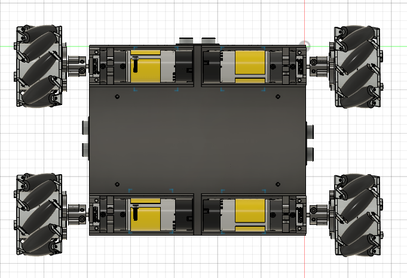

# Iteration 1 – Expanding Beyond the Original Chassis

## Overall CAD Design

  

## Drivetrain Layout

  

## Structural Issue Encountered

---

## Objective

The original rover chassis from the robotics kit was designed for significantly smaller motors and fewer onboard sensors. After upgrading the drivetrain with larger motors, LiDAR, ultrasonic sensors, a camera, Raspberry Pi, motor drivers, and additional electronics, the original chassis no longer provided sufficient space.

Since I did not have access to a CNC machine, the chassis had to be redesigned as a 3D-printable assembly using PLA. The goal of this iteration was to create a larger platform while remaining within the build volume of my desktop 3D printer.

---

## Design Goals

- Increase the overall chassis footprint to accommodate larger motors.
- Provide dedicated mounting locations for all sensors and electronics.
- Maintain a modular stacked architecture for easy maintenance and upgrades.
- Keep the entire chassis within the printable area of a consumer-grade 3D printer.

---

## Design Decisions

- Increased the chassis footprint to accommodate larger motors.
- Added multiple levels for electronics and sensors.
- Created dedicated mounting locations for:
  - Raspberry Pi
  - Motor drivers
  - LiDAR
  - Ultrasonic sensors
  - Camera
- Used aluminum standoffs to separate the electronics layers.
- Designed the base plate to fit within the maximum printable area of the printer.

---

## What Worked

- Successfully packaged every component onto the rover.
- Created dedicated mounting positions for sensors and electronics.
- The stacked architecture simplified wiring and future modifications.
- Sensor placement provided good fields of view for future perception algorithms.
- Demonstrated that the larger chassis could support the intended hardware layout.

---

## Problems Discovered

Although the packaging was successful, this design revealed an important mechanical issue.

### Weight Distribution

The four DC gear motors were the heaviest components on the rover and were mounted near the outer edges of the chassis.

Because the chassis was significantly larger than the original kit design, the center of the base plate had a long unsupported span. As more components were installed, the PLA chassis began to flex noticeably.

### Structural Rigidity

The base plate was printed entirely from PLA and lacked reinforcing ribs or structural supports underneath the center section.

While the design met the packaging requirements, it did not provide sufficient stiffness for the combined weight of the drivetrain, electronics, batteries, and sensor stack.

Rather than risking permanent deformation or cracking during testing, I decided to stop development on this version and redesign the mechanical structure before continuing the build.

---

## Lessons Learned

This iteration highlighted that fitting every component onto a robot is only one aspect of mechanical design.

Future iterations would focus on:

- Improving structural rigidity.
- Reducing chassis flex.
- Creating better load paths between the motors.
- Providing additional reinforcement beneath the center of the chassis.
- Designing for both manufacturability and long-term durability.

---

## Key Takeaways

- ✅ Successfully expanded beyond the original kit chassis.
- ✅ Verified the packaging of all major components.
- ✅ Developed a modular multi-level electronics layout.
- ❌ Underestimated the effect of weight distribution.
- ❌ Insufficient structural support resulted in significant PLA bending.
- ➜ The next iteration would prioritize chassis strength before additional integration.
