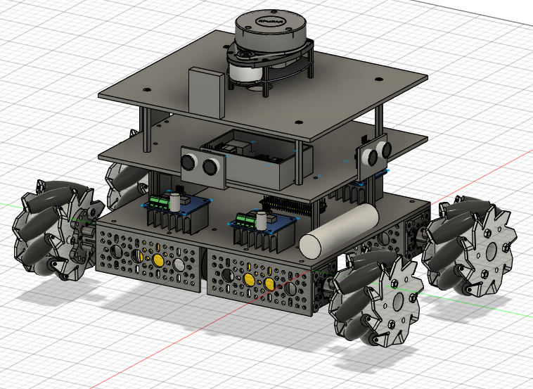

# Iteration 1 – Expanding Beyond the Original Chassis

## Overall CAD Design

  

## Drivetrain Layout

  

## Structural Issue Encountered

---

## Objective

The original rover chassis from the robotics kit was designed for significantly smaller motors and fewer onboard sensors. After upgrading the drivetrain with larger motors, LiDAR, ultrasonic sensors, a camera, Raspberry Pi, motor drivers, and additional electronics, the original chassis no longer provided sufficient space.

Since I did not have access to a CNC machine, the chassis had to be redesigned as a 3D-printable assembly using PLA. The goal of this iteration was to create a larger platform while remaining within the build volume of my desktop 3D printer.

---

## Design Goals

- Increase the overall chassis footprint to accommodate larger motors.
- Provide dedicated mounting locations for all sensors and electronics.
- Maintain a modular stacked architecture for easy maintenance and upgrades.
- Keep the entire chassis within the printable area of a consumer-grade 3D printer.

---

## Engineering Challenges

### Weight Distribution

The four DC gear motors were the heaviest components on the rover and were mounted near the outer edges of the chassis. While the design successfully packaged all components, the weight distribution introduced an unexpected structural issue.

### Structural Rigidity

The large PLA base plate lacked sufficient reinforcement beneath its center span. As the drivetrain, batteries, and electronics were installed, the chassis began to flex noticeably.

Rather than risking damage to the rover or continuing development on a weak mechanical foundation, I chose to redesign the chassis before moving forward.

---

## Lessons Learned

- Packaging all components is only one aspect of robot design.
- Structural rigidity is equally important as available space.
- Designing around manufacturing constraints (3D printer dimensions) can introduce new engineering tradeoffs.
- Future iterations would prioritize stiffness, reinforcement, and improved load paths before adding additional features.
