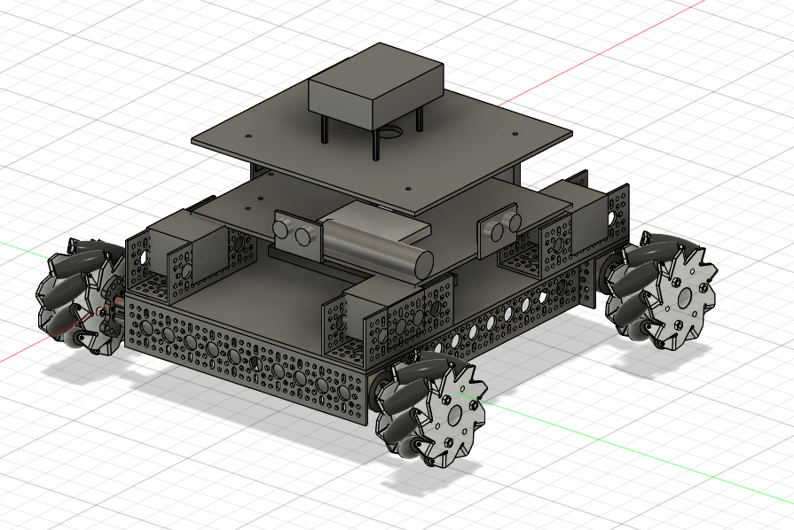
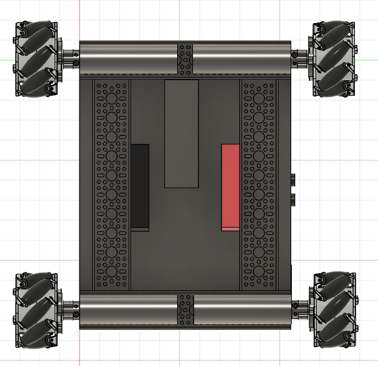

# Iteration 2 – Hybrid Aluminum Chassis Redesign

## Updated Rover Assembly

  

## Bottom Chassis Layout

  

## Fabrication Process

---

## Objective

After completing the first prototype, it became clear that the PLA chassis lacked the structural rigidity required to support the weight of the drivetrain, batteries, and electronics. Rather than increasing the thickness of the printed parts, the next iteration focused on creating a hybrid aluminum and PLA chassis that would significantly improve stiffness while remaining relatively simple to manufacture.

---

## Design Goals

- Eliminate chassis flex observed during Iteration 1.
- Maintain compatibility with hobbyist fabrication tools.
- Create a rigid drivetrain structure.
- Retain the modular multi-level electronics layout.
- Minimize additional machining operations.

---

## Major Design Changes

### Hybrid Aluminum Frame

The largest change in this iteration was replacing the lower structural PLA chassis with an aluminum frame while retaining the upper two 3D printed platforms.

Eight mounting holes were drilled into the aluminum plate, allowing it to bolt directly to the vertical U-channels. This created a much stronger foundation while still allowing the upper electronics decks to remain lightweight and easy to modify.

---

### Reinforced Drivetrain

To increase structural rigidity, two aluminum cross members were added between the left and right drivetrain assemblies.

These members connected the upper and lower U-channels that housed the motors, creating a closed rectangular frame instead of relying on individual side rails.

This dramatically reduced chassis flex while providing a much stronger load path between all four motors.

---

### U-Channel End Connections

Aluminum end plates were installed at the front and rear of the chassis to connect all four drivetrain U-channels into a single rigid structure.

Instead of each wheel assembly acting independently, the drivetrain became one continuous frame capable of distributing loads throughout the chassis.

---

### Electronics Mounting

Drilling additional mounting holes for electronics standoffs proved to be time-consuming and difficult.

Instead of creating custom brackets, additional aluminum U-channels were installed along the sides of the chassis.

These channels served two purposes:

- Supported the motor drivers.
- Allowed the lip of each motor driver to clamp the middle PLA platform securely into place.

This eliminated the need for several additional standoffs while simplifying assembly.

---

### Battery and Power Distribution

To maximize the available space on the electronics deck, the battery and power distribution components were relocated beneath the chassis.

Zip ties were used to secure these components between the side aluminum rails, lowering the center of gravity while freeing space for future electronics expansion.

---

## What Improved

- Significantly increased structural rigidity.
- Eliminated the major chassis flex observed in Iteration 1.
- Stronger load transfer between all four wheel assemblies.
- Better use of vertical space throughout the robot.
- More modular drivetrain construction.
- Aluminum frame provided a much stronger mechanical foundation while preserving lightweight 3D printed electronics decks.

---

## Engineering Challenges

Although the redesign greatly improved the mechanical structure, fabrication introduced new challenges.

### Manual Fabrication

Without access to CNC equipment, every aluminum component had to be measured, cut, drilled, and assembled by hand.

Achieving accurate hole placement required significantly more time than expected.

---

### Manufacturing Tradeoffs

Because drilling numerous precision holes was difficult using basic tools, several mounting solutions were redesigned to simplify manufacturing.

Rather than adding additional brackets and standoffs, existing structural members were repurposed to support both the electronics and the chassis simultaneously.

This reduced fabrication complexity while still producing a robust final assembly.

---

## Lessons Learned

This redesign demonstrated that mechanical design extends beyond CAD modeling. Manufacturing constraints directly influence design decisions.

Using aluminum only where structural strength was required while retaining 3D printed components for the upper electronics created a lightweight yet significantly more rigid platform.

The redesign also reinforced the importance of designing around available fabrication methods. Simpler manufacturing often leads to more reliable assemblies than highly optimized designs that are difficult to build.

---

## Key Improvements Over Iteration 1

- ✅ Replaced the structural PLA base with aluminum.
- ✅ Connected the drivetrain into a single rigid frame.
- ✅ Added cross members to eliminate chassis flex.
- ✅ Lowered the battery beneath the chassis.
- ✅ Simplified electronics mounting using existing structural members.
- ✅ Created a stronger platform for future autonomy hardware and sensor integration.
