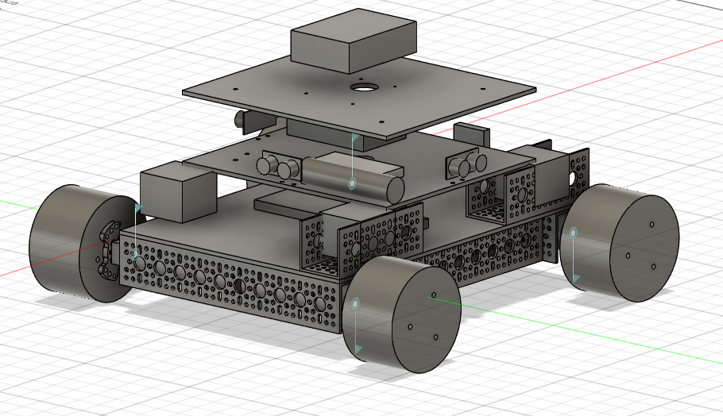

# Iteration 3 – Simulation-Oriented Redesign

## Simulation-Ready CAD Model

---

## Objective

After completing the physical prototype, the next objective was to create a CAD model optimized for simulation rather than manufacturing. The goal was to generate a clean URDF that could be imported into NVIDIA Isaac Sim for physics simulation, ROS 2 integration, synthetic data generation, and autonomous software development.

While the physical robot accurately represented the real hardware, it contained many imported CAD models and unnecessary geometric detail that complicated the simulation workflow.

---

## Why a Redesign Was Necessary

The physical rover used several imported CAD assemblies, including:

- Mecanum wheels
- LiDAR
- Camera
- Ultrasonic sensors
- Various electronic components

Although these models looked realistic, they introduced several issues when exporting to URDF and importing into Isaac Sim.

These included:

- Complex meshes that increased simulation overhead.
- Imported assemblies that were difficult to convert into clean URDF links.
- Components importing as fixed Xforms that were difficult to modify.
- Difficulty attaching simulated sensors to specific locations on the robot.

---

## Design Changes

### Simplified Mechanical Geometry

Many detailed CAD assemblies were replaced with simplified geometry that preserved the overall dimensions of the robot while dramatically reducing mesh complexity.

Examples included:

- Simplified wheel assemblies
- Basic sensor housings
- Simplified electronics
- Reduced mechanical detail throughout the chassis

The objective was not to create a visually identical robot, but to create a model that accurately represented the robot's structure while remaining simulation-friendly.

---

### URDF-Friendly Structure

The Fusion 360 assembly was reorganized into a cleaner link hierarchy for URDF export.

Rigidly connected components were grouped together, while moving components such as the wheels were isolated into individual links connected through revolute joints.

This greatly simplified the URDF generation process and reduced import issues inside Isaac Sim.

---

### Improved Sensor Integration

One of the biggest limitations of the original CAD model was that many imported assemblies became difficult to interact with after import.

Because of this, attaching simulated sensors such as cameras and LiDAR to specific locations on the robot became unnecessarily complicated.

By simplifying the CAD model, each sensor location became much easier to modify and allowed simulated sensors to be attached directly to the appropriate links within Isaac Sim.

---

## Engineering Challenges

### CAD Complexity vs. Simulation Performance

A manufacturing model and a simulation model have different design goals.

Highly detailed CAD models are useful for fabrication but often create unnecessary complexity for physics simulation.

Reducing mesh complexity significantly improved the simulation workflow while preserving the overall kinematics and dimensions of the robot.

---

### Digital Twin Design

Rather than reproducing every bolt and bracket, this iteration focused on building a functional digital twin that accurately represented:

- Robot dimensions
- Joint locations
- Wheel placement
- Sensor mounting positions
- Robot kinematics

This produced a cleaner foundation for future autonomous software development.

---

## Lessons Learned

Simulation-ready robots require a different design philosophy than manufacturing-ready robots.

Instead of maximizing visual realism, the focus shifted toward creating a lightweight, modular CAD model that could be easily exported, modified, and integrated into Isaac Sim.

This redesign greatly simplified the URDF generation process while making future work involving ROS 2, computer vision, synthetic data generation, and autonomous navigation significantly easier.

---

## Key Improvements Over Iteration 2

- ✅ Simplified imported CAD models.
- ✅ Reduced mesh complexity.
- ✅ Cleaner URDF export.
- ✅ Easier Isaac Sim import.
- ✅ Improved sensor placement.
- ✅ Better foundation for ROS 2 and autonomous software development.
